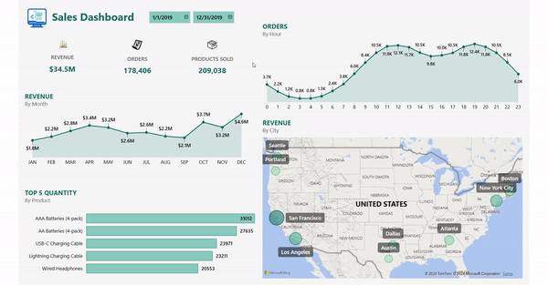

# E-Commerce Sales Analysis

## Objective

The objective of using this dataset for analysis and creating an interactive Power BI dashboard is to derive actionable insights into the company's sales and customer preferences.

You can view the completed interactive dashboard [here](https://admin.onhandbi.com/#/user/report/TmpnMQ==?tenant=ohbi_tenant).

## About the dataset:

The dataset comprises detailed information about transactions on the company's E-commerce platform in 2019.

`Order ID`: A unique identifier for each order.

`Product`: The name of the product ordered.

`Quantity Ordered`: The quantity of the product ordered in each transaction.

`Price Each`: The unit price of the product.

`Order Date`: The date and time when the order was placed.

`Purchase Address`: The address where the product was shipped to.

## Approach

1. First, Python was utilized for data preprocessing.

2. Next, SQL queries were employed to address specific questions regarding sales data.

3. Finally, the dataframes were exported from a CSV file and imported into Power BI for visualization.

## Data Insights

- Which month has the highest sales volume? What is the sales figure for that month?
- Which city has the highest sales volume?
- At what time frame does the business need to advertise to increase customer purchasing likelihood?
- Which products are often sold together?
- Which product sells the most? What is your hypothesis about the reason for this product selling the most?
